# UML

## Blueprints

### all

#### all_domain_model

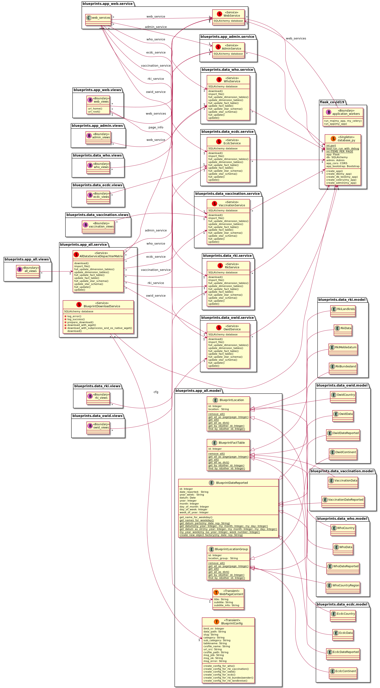

#### all_domain_model_import

#### all_domain_model_import

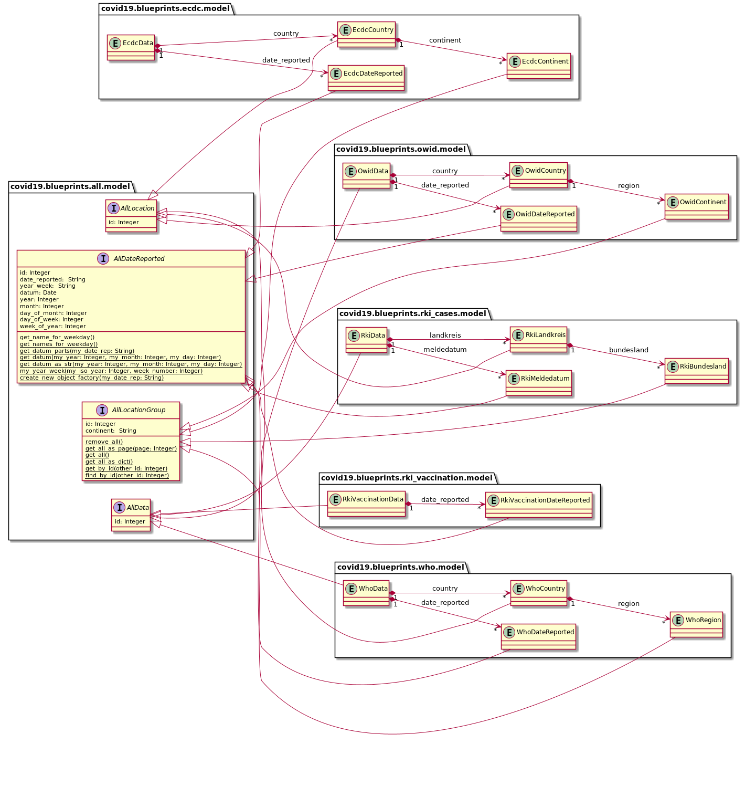

#### all_use_cases

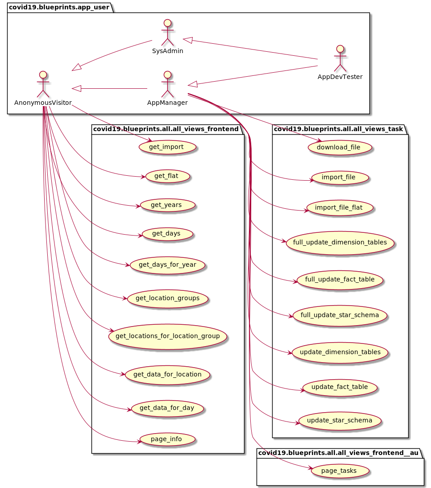

### app_application

#### app_application_domain_model

#### app_application_use_cases

### ecdc

#### ecdc_domain_model

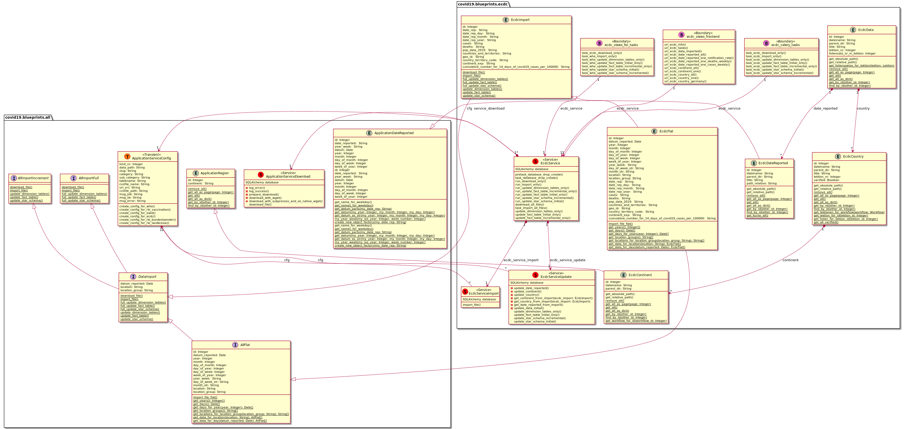

#### ecdc_domain_model_import

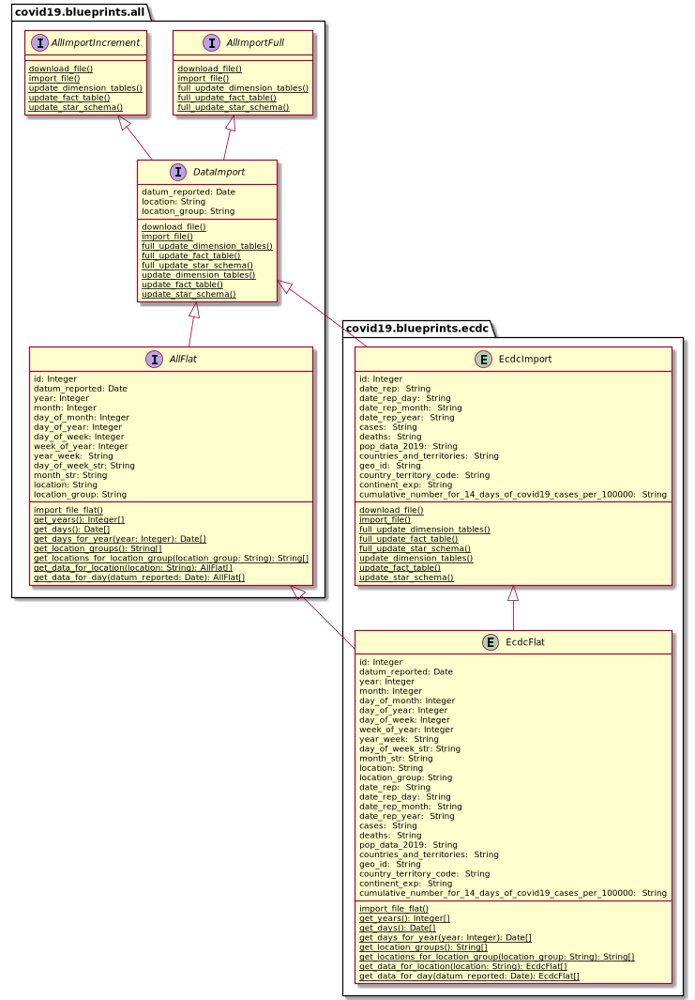

#### ecdc_use_cases

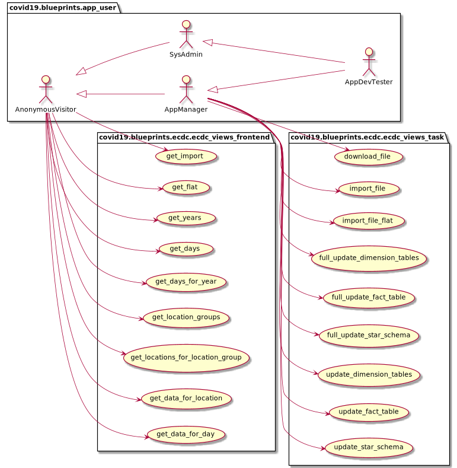

### owid

#### owid_domain_model

#### owid_domain_model_import

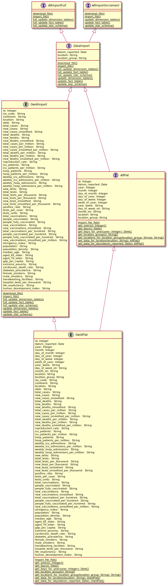

#### owid_use_cases

#### owid_use_cases_visual_data_1

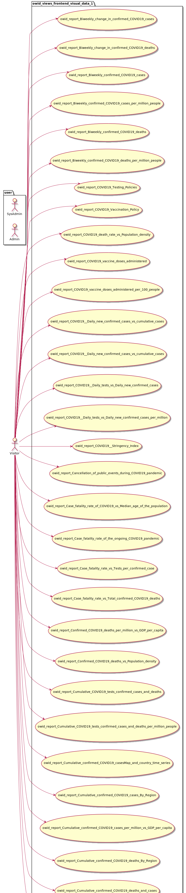

#### owid_use_cases_visual_data_2

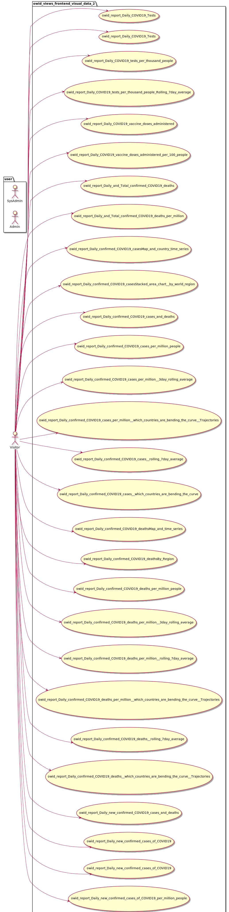

#### owid_use_cases_visual_data_3

#### owid_use_cases_visual_data_4

#### owid_use_cases_visual_data_5

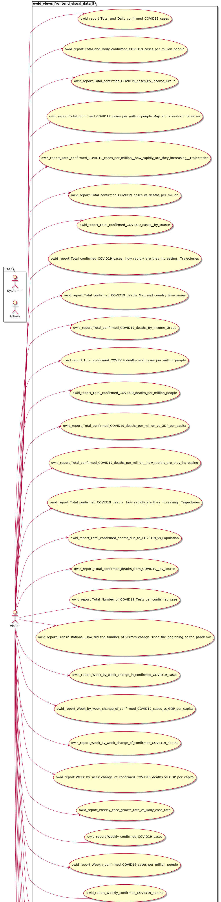

### rki_vaccination

#### rki_vaccination_domain_model

#### rki_vaccination_domain_model_import

#### rki_vaccination_use_cases

### who

#### who_domain_model

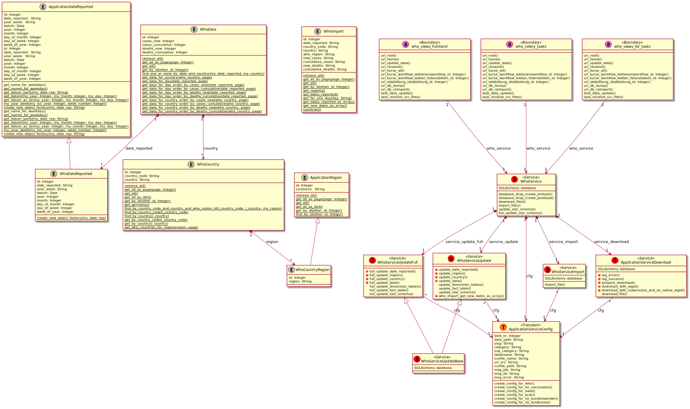

#### who_domain_model_import

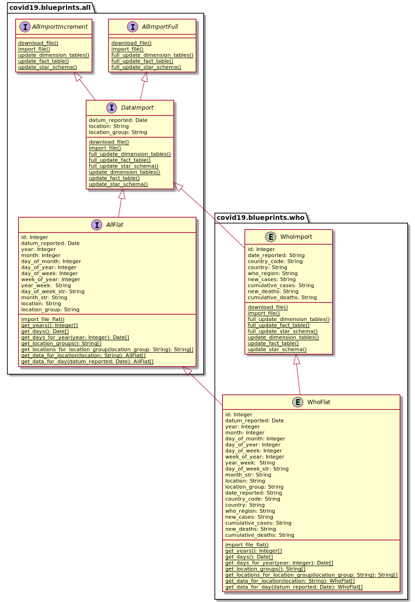

#### who_use_cases

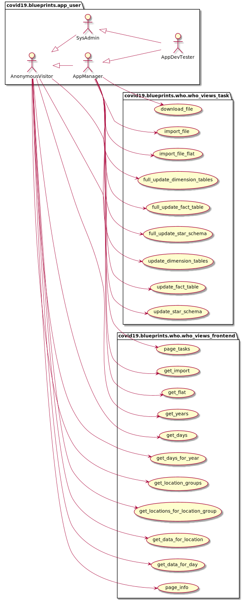
